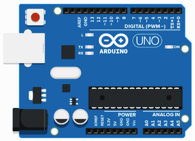
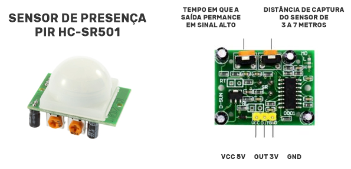
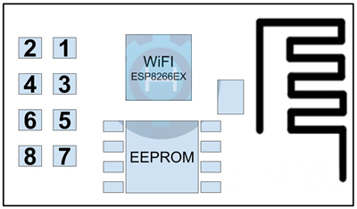
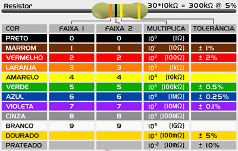

## Arduino

>
Neste diretório fica salvo todos os arquivos referentes a documentação especifica do arduino. Aqui é descobrir quais componentes foram utilizandos para realização do projeto como também as características de cada componente utilizado e como eles se comunicam.

### Componentes

- 01 Arduino Uno R3
- 01 Módulo ESP8266
- 01 PIR Sensor
- 01 Resistor 230 ohm
- 01 Resistor 220 ohm

### Arduino Uno

O Arduino é uma plataforma eletrônica de código aberto baseada em hardware e software fáceis de usar. Placas Arduino são capazes de ler entradas.
Você pode dizer à sua placa o que fazer enviando um conjunto de instruções para o microcontrolador na placa. Para fazer isso, você usa a linguagem de programação Arduino (baseada em Fiação ) e o Software Arduino (IDE) , baseado em Processamento.

  

Ao longo dos anos, o Arduino tem sido o cérebro de milhares de projetos, desde objetos do cotidiano até instrumentos científicos complexos. Uma comunidade mundial de criadores - estudantes, amadores, artistas, programadores e profissionais reuniu-se em torno dessa plataforma de código aberto, e suas contribuições contribuíram para uma incrível quantidade de conhecimento acessível que pode ser de grande ajuda para novatos e especialistas.

Você pode encontra o esquemático desse microcontrolador [aqui](https://www.arduino.cc/en/uploads/Main/Arduino_Uno_Rev3-schematic.pdf). Você pode encontrar outro projetos [aqui](https://create.arduino.cc/projecthub). 

### PIR Sensor

  

Este módulo permite o ajuste da sensibilidade do sensor, ou seja, à qual distância um objeto será detectado (3 à 7 metros) , e também o tempo de delay (tempo que a saída permanece acionada, em nível alto), de 5 a 200 segundos. Os ajustes são feitos nos 2 potenciômetros soldados à placa.

O sensor aceita alimentação de 4,5 à 20V, e a conexão com o Arduino utiliza apenas um pino, que apresenta o estado HIGH (alto), ao detectar um movimento, e LOW (baixo) quando não há movimentação perto do sensor.

### Módulo ESP8266

Arduino. O módulo ESP8266 permite uma conexão Wi- Fi  com um sistema embarcado. Este módulo oferece uma solução completa para conexões de rede WiFi. Pode ser usado como host ou cliente em uma rede Wi-Fi.

O ESP8266 é um dos chips com maior integração do industrial. Inclui uma antena, interruptores, um amplificador de potência, receptores de amplificador de baixo ruído, módulos de gerenciamento de energia. Seu design foi pensado para ocupar uma área mínima.

#### Características

	- 802.11 b/g/n
	- Microcontrolador de baixa potência de 32 bits
	- ADC-10-bit integrado
	- Pilha de protocolo TCP/IP
	- Wi-Fi 2,4 Ghz, suporta WPA-WPA2
	- Suporta STA-AP-STA + AP
	- Suporta recursos Smart LInk para dispositivos Android e iOS
	- SDIO 2.0, SPI, UART, I2C, I2S, IR remoto, PWM, GPIO
	- STBC, 1.1 MIMO, 2X1 MIMO
	- Salvando o modo até < 10uA
	- Acorde da hibernação e transmita pacotes em menos de 2 ms
	- Consumo em espera de < 1,0 mW
	- Potência de saída de +20 dBm
	- Faixa de temperatura de -40C a 125C
	- Certificação FCC, CE, TELEC, WiFi Alliance e SRRC

  

    01 - GND - Conexão com GND digital
    02 - TXD - Pin de transmissão, niveis TTL de 3.3V.
    03 - GPIO2 - Pin de entrada e saíde de propósito geral.
    04 - CH_PD - CH_PD = 0, Desligado, CH_PD = 1, Ligador.
    05 - GPIO - Pin de entrada e saída de propósito geral.
    06 - RST - Ativo com 0.
    07 - RXD - Pin de recepção de dados, níveis TTL de 3.3V.
    08 - VCC - Alimentação de Voltagem 3.3V típico e 3.6V no máximo.

Para utilização deste módulo junto ao arduino foi utilizando dos comandos AT para realizar a transferência de dados e propórsionar o comportamento desejado.

### Resistores

É possível determinar o valor da resistência de um resistor de duas maneiras, uma utilizando equipamentos de medição de resistência, como o multímetro, e de outro modo utilizando uma tabela de cores. Para a segunda opção a identificação por meio da tabela de cores, se da através das cores contidas no corpo do resistor.

Para resistores de 3 faixas é utilizada a tabela abaixo seguindo as orientações citadas.

- Faixa 1: Mostra o primeiro algarismo do valor da resistência.
- Faixa 2: Mostra o segundo algarismo da resistência.
- Faixa 3: Mostra quantos zeros devem ser adicionados a resistência.

<b>Observação:</b> Para os resistores de 3 faixas a tolerância pode ser considerada em ± 20%, sendo definido sem cor.

  

### Comandos AT

Os comandos AT foram muito utilizados no decorer deste projeto e graças ao seu entendimento foi possível realizar as requisições para nossa api e realizar o registro dos movimentos detectados. Para conhecer mais sobre os comandos AT acesse o [link](http://room-15.github.io/blog/2015/03/26/esp8266-at-command-reference/).

### Circuito Utilizado no Projeto

O circuito abaixo foi montado para prover a ação de captura de movimentações necessárias para o projeto, na imagem abaixo podemos verificar como cada componente do arduino se conecta com os demais, verificando as portas lógicas utilizadas como também a energização dos componentes.

  

### Código

O código do projeto arduino pode ser encontrado em <a href="https://github.com/sancozta/safetyardu">sancozta/safetyardu</a>, neste repositório pode ser encontrado o código final utilizado pelo arduino, como também dois códigos criados para realizar os testes nos módulos de wifi e de detecção de movimento.

