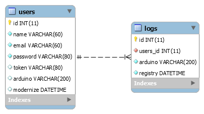

### Database

>Nesta seção podemos verificar todos os itens referentes a documentação especifica do database.

O banco de dados criado para atender a necessidade desta integração é bastante simples e foi criado em MySQL, é composto por apenas duas tabelas, que são **users** e a **logs**. Esta duas tabelas são relacionadas afim de manter as diversas dectecções para um determinado usuário atráves do Serial Number único presente em cada placa arduino. Com isso limitamos o usuário a poder associar apenas um dispositivo a seu usuário dentro do sistema.

Abaixo podemos visualizar como foi modelado a estrutura do banco de dados que como podemos ver é bastante simples porém atende a necessidade da integração pois o foco deste trabalho foi realizar a integração de diversas tecnologias criadas com a linguagem python e não um modelo de banco de dados complexo e com diversos conceitos da modelagem de dados aplicados.

O banco de dados como falado anteriormente foi criado no SGBD MySQL e foi colocado em cloud com acesso externo liberando portanto com acesso a internet e um bom client é possível se conectar ao banco e realizar a consultar ou ações desejadas.

Utilizamos o serviços da Umbler para hospedar gratuitamente o banco de dados. Porém nosso plano grátis acaba em janeiro de 2019 portanto caso não consulta acessar os banco de dados fique ciente que nosso periodo de utilização já pode ter expirado.

De qualquer forma é possível subir o banco localmente basta ter o banco de dados MySQL instalado, utilizando o [Workbranch](https://dev.mysql.com/downloads/workbench/) esse trabalho pode ser facilitado. Basta baixar o modelo de dados presente na pasta **database** do repositório **safetyflask** no github acessando o link [sancozta/safetyflask](https://github.com/sancozta/safetyflask).

Com o modelo do banco **safety.mwb** em mãos basta abri-lo no programa workbranch é acessar **Database >> Forward Engineer** e seguir os passos para que seu modelo seja criado na conexão que você desejar.