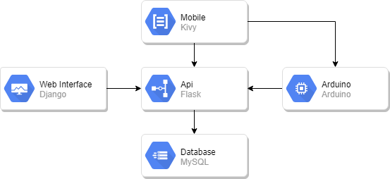

## Integração Python

Esta documentação busca expor como foi realizada a intergração de várias tecnologias python,
objetivando a composição de um sistema capaz de registrar entradas não previstas em ambiente domiciliar.

### Tecnologias Envolvidas

- Framework Django
- Framework Flask
- Mobile Com Kivy
- Banco de Dados MySQL
- Arduino

### Arquitetura

Para integrar todas essas tecnologias foi necessário determinar explicitamente onde cada uma seria envolvida. Com o objetivo de ter na sua conclusão um estável funcionamento do produto final. Sendo assim como banco de dados foi utilizado o <a href="https://www.mysql.com/">MySQL</a> e para centralizar as operações de persistência neste banco foi adicionada a api sendo escrita com <a href="http://flask.pocoo.org/">Flask</a>. Com a centralização da persistência de dados sendo feita pela api, os outros componentes passam a requisitarem este componente. A web interface foi construída utilizando o <a href="https://www.djangoproject.com/">Django</a> com seus padrões de projeto. Nos termos de aplicativo mobile utilizamos a tecnologia <a href="https://kivy.org/">Kivy</a>. Por fim como dispositivo de captura de movimentações no ambiente utilizamos o <a href="https://www.arduino.cc/">Arduino</a> e seus componentes e módulos.

  

### Documentação do Projeto

Para realizar a documentação deste projeto foi utilizando a biblioteca [gitbook](https://github.com/sancozta/docs), seguindo 
sua estrutura para gerar os artefatos padronizados aqui expostos.

Esta documentação pode ser encontrada em sua forma mais bruta no link [safetydocs](https://github.com/sancozta/safetydocs).

- Gerando build.

      gitbook build ./ ./book

- Iniciando Serve Para Previa.

      gitbook serve ./ ./book

- Gerando Pdf do Conteúdo.

      gitbook pdf ./ ./book.pdf